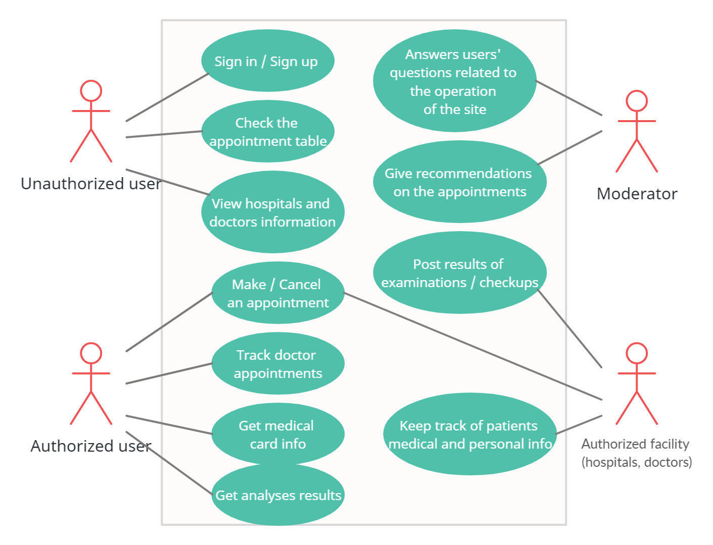

## Roles

#### Unauthorized user
* View hospitals and doctors information
* Check the appointment table
* Sign in/ Sign up

#### Authorized patient
* Get medical card info
* Make / Cancel an appointment
* Get analyses results
* Track doctor appointments

#### Authorized facility (hospitals, doctors)
* Make / Cancel an appointment
* Keep track of patients medical and personal info
* Post results of examinations/checkups

#### Moderator
* Answers users' questions related to the operation of the site
* Give recommendations on the appointments

## Use case

## User stories

#### User story №1
As a patient, I don't want any difficulties managing my appointments

#### User story №2
As a patient, I want to have fast access to my medical history

#### User story №3
As a patient, I want to have readable medical reports and recipes

#### User story №4
As a facility worker, I want to have easy access to patient's full medical history

#### User story №5
As a facility worker, I want to switch from paper document flow to electronic

#### User story №6
As a hospital, I want to be able to aggregate and analyse data about stationed doctors and patients

#### User story №7
As a moderator, I want to help users make heads and tails of our service

## Job stories

#### Job story №1
When a user has visited hospital, I want them to share feedback, so I can let them leave a review

#### Job story №2
When there are a lot of people waiting in the queue, I want to differ person who has an appointment, so I can prioritize people with appointments

#### Job story №3
When patient wants to make an appointment, I want to rate doctors, so I can recommend best-suited doctor
